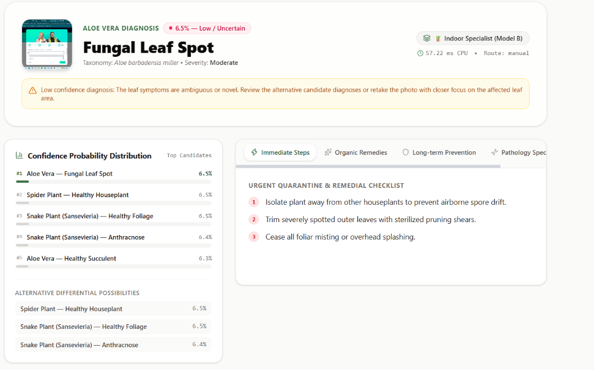
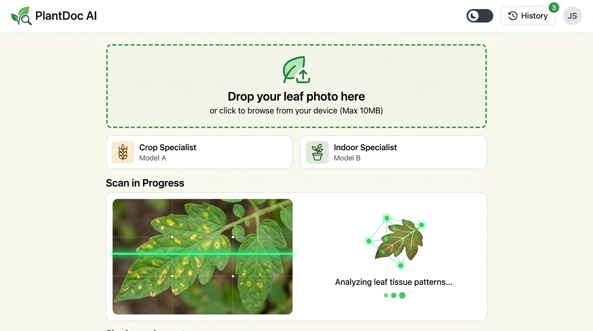
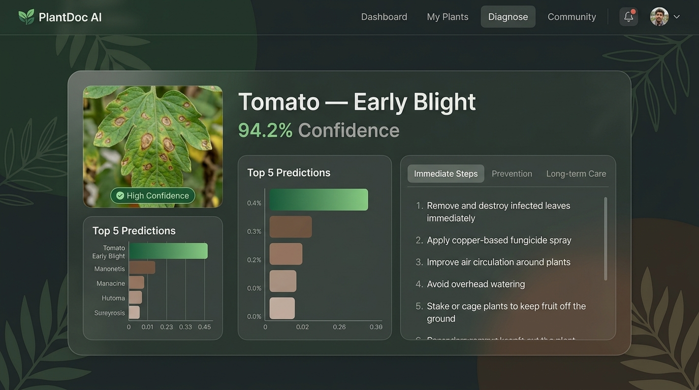
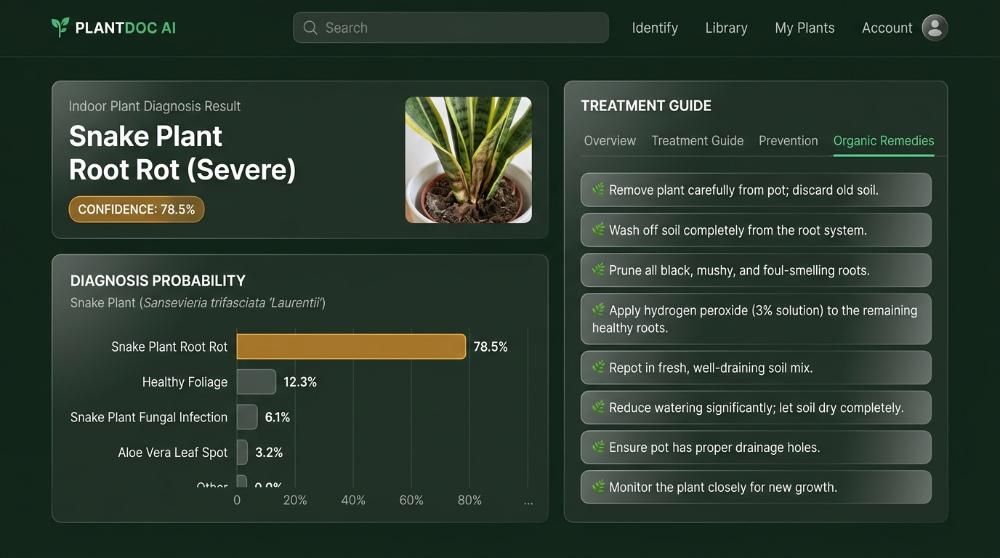

# 🌿 PlantDoc AI — Plant Disease Diagnosis Platform

> Full-stack AI application for real-time plant disease diagnosis using dual specialized deep learning models.

<p align="center">
  
  
  
  
  
  
</p>

---

## 📸 Interface Preview

<div align="center">
  
  <p><em>Real-time diagnosis view showing confidence probability distribution, entropy-based certainty calibration, and actionable remedial checklist.</em></p>
</div>

<details>
<summary><b>🔍 View Additional Workflow Previews</b></summary>
<br/>

| Upload & Pre-Flight Scan | Crop Specialist Diagnosis | Indoor Specialist Diagnosis |
|:---:|:---:|:---:|
|  |  |  |

</details>

---

## ✨ Features

- **Dual-Model AI Engine** — Two fine-tuned MobileNetV2 CNNs: one for agricultural crop diseases and one for indoor houseplants.
- **Intelligent Auto-Routing** — Dynamically selects the optimal model based on visual features and confidence-delta analysis.
- **Shannon Entropy Confidence Calibration** — Accurately flags ambiguous or low-certainty predictions with advisory warnings.
- **Clinical Treatment Reports** — Structured remedial recommendations including immediate actions, organic remedies, long-term prevention, and pathology specs.
- **Top-5 Probability Distribution** — Visual probability breakdown showing ranked differential diagnoses.
- **30+ Plant & Crop Conditions** — Broad coverage across fruit, vegetable, and ornamental houseplant pathogens.
- **Sub-60ms CPU Inference** — Powered by ONNX Runtime with full graph optimization.
- **Modern Botanic UI** — Responsive drag-and-drop upload, animated scanning, dark mode, and interactive demo showcases.

---

## 🏗️ Architecture

```text
PlantDoc/
├── assets/                                  # Screenshots and documentation media
│   └── diagnosis_screenshot.png
├── backend/                                 # FastAPI + ONNX Runtime
│   ├── app/
│   │   ├── api/                             # REST endpoints (/predict, /health, /stats, /classes)
│   │   ├── core/                            # Config & intelligent router engine
│   │   ├── data/                            # Disease database (JSON), class mappings
│   │   ├── models/                          # ONNX model files (see Releases)
│   │   └── services/                        # Inference engine, treatment service, validator
│   ├── Dockerfile
│   └── requirements.txt
│
├── frontend/                                # React 18 + Vite + TailwindCSS
│   └── src/
│       ├── components/                      # ResultsView, TreatmentTabs, ConfidenceChart, ShowcaseSection
│       └── utils/                           # API client
│
├── Model_A_Crop_Disease_MobileNetV2.ipynb    # Training notebook — Model A (Agricultural Crops)
└── Model_B_Indoor_Plant_MobileNetV2.ipynb   # Training notebook — Model B (Houseplants)
```

---

## 🚀 Getting Started

### Prerequisites
- **Python** 3.10+
- **Node.js** 18+ & **npm**

---

### 1. Backend Setup

```bash
cd backend

# Create and activate a virtual environment
python -m venv .venv

# Windows:
.venv\Scripts\activate
# macOS/Linux:
source .venv/bin/activate

# Install dependencies
pip install -r requirements.txt

# Start the FastAPI server
python run.py
```

> **Note:** ONNX model files are not committed to git due to file size limits.  
> Download them from the [GitHub Releases](../../releases) page and place them in `backend/app/models/`.

The backend API documentation will be available at [http://localhost:8000/docs](http://localhost:8000/docs).

---

### 2. Frontend Setup

```bash
cd frontend

# Install Node dependencies
npm install

# Start the Vite development server
npm run dev
```

The application will be accessible at [http://localhost:5173](http://localhost:5173).

---

## 🧠 Tech Stack

| Layer | Technology | Description |
|---|---|---|
| **ML Framework** | MobileNetV2 (fine-tuned), ONNX Runtime | Low-latency CPU inference engine (<60ms) |
| **Backend API** | FastAPI, Python 3.10, Uvicorn | Async REST API with Pydantic validation |
| **Frontend UI** | React 18, Vite, TailwindCSS, Lucide Icons | Responsive botanic UI with light/dark themes |
| **Containerization** | Docker | Production container image |

---

## 📄 License

This project is licensed under the MIT License — see the [LICENSE](LICENSE) file for details.
